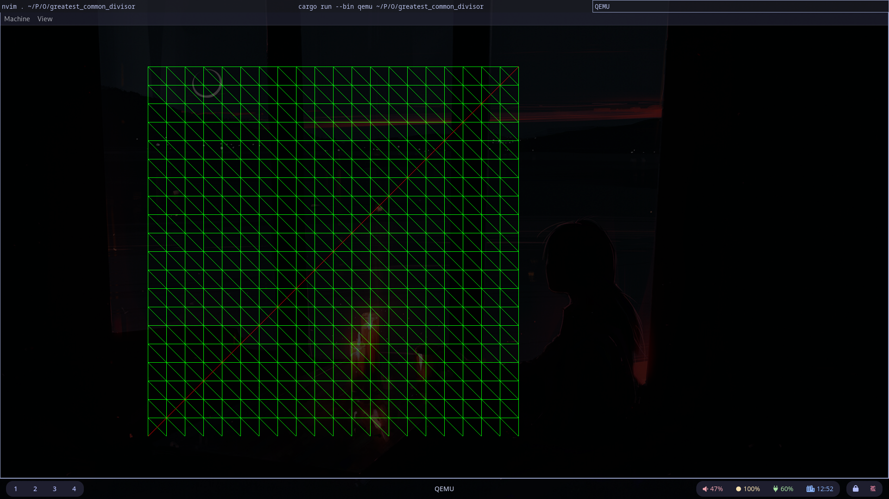

# Greatest Common Divisor

An implementation of the greatest common divisor mechanism introduced in page 2 of Dijkstra's *A Discipline of Programming*. Written as a tiny kernel based on [phil-opp's blog_os repository](https://github.com/phil-opp/blog_os/blob/edition-3/) because I genuinely cannot be bothered to learn graphics programming properly and this is the easiest way to get a simple framebuffer that I know of. Non-interactive for now, but that may change in the future.

## What's the Mechanism?

## Screenshot

